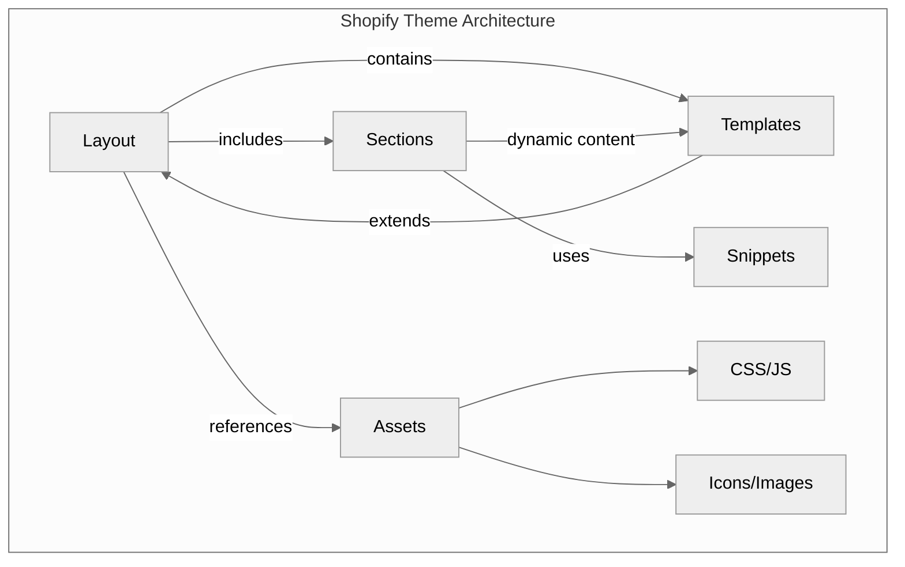
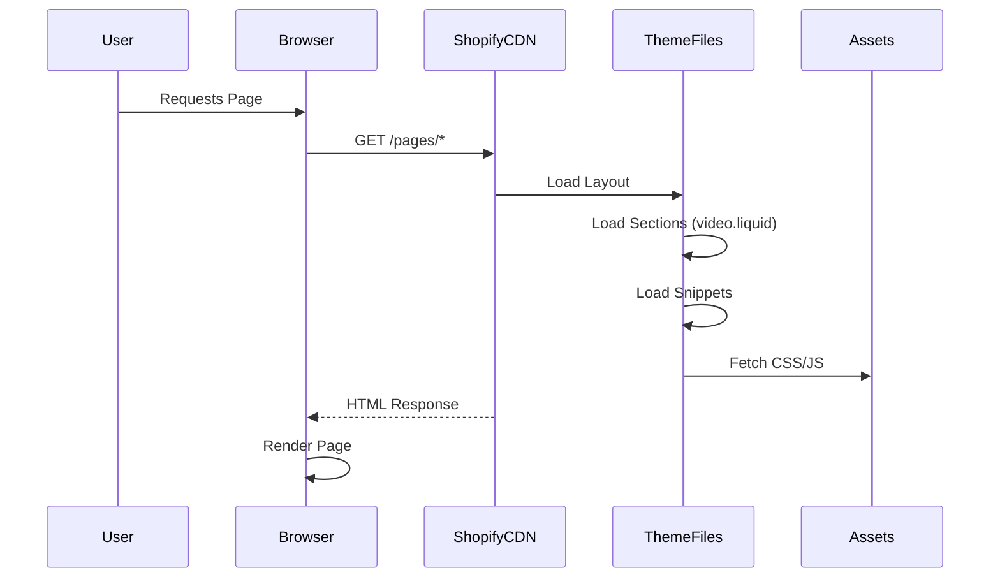

# Project Architecture Diagram

## Architecture Diagram

```mermaid
%%{init: {'theme': 'neutral', 'themeVariables': { 'primaryColor': '#e3f2fd'}}}%%
graph TD
    subgraph Shopify Theme Architecture
        A[Layout] -->|contains| B[Templates]
        A -->|includes| C[Sections]
        C -->|uses| D[Snippets]
        A -->|references| E[Assets]
        E --> F[CSS/JS]
        E --> G[Icons/Images]
        B -->|extends| A
        C -->|dynamic content| B
    end
```

## Page Render Sequence

```mermaid
sequenceDiagram
    participant User
    participant Browser
    participant ShopifyCDN
    participant ThemeFiles

    User->>Browser: Requests Page
    Browser->>ShopifyCDN: GET /pages/*
    ShopifyCDN->>ThemeFiles: Load Layout
    ThemeFiles->>ThemeFiles: Load Sections (video.liquid)
    ThemeFiles->>ThemeFiles: Load Snippets
    ThemeFiles->>Assets: Fetch CSS/JS
    ShopifyCDN-->>Browser: HTML Response
    Browser->>Browser: Render Page
```