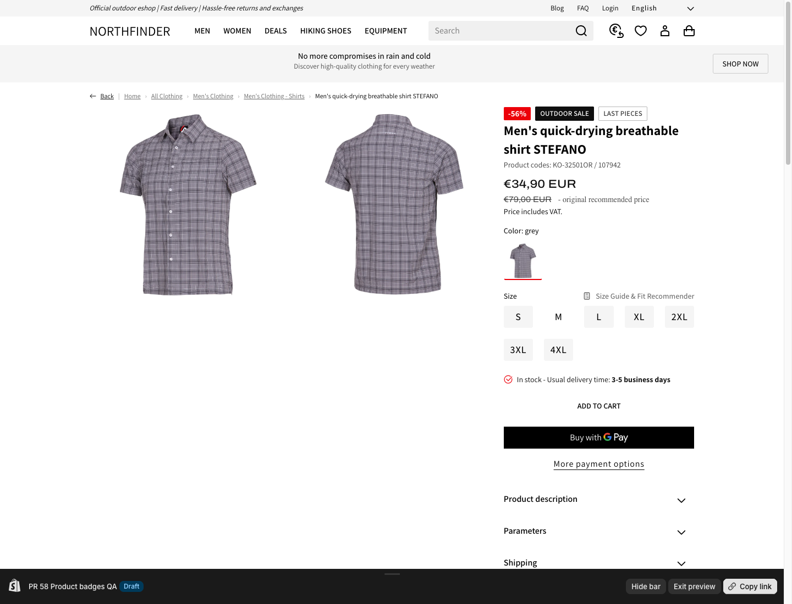
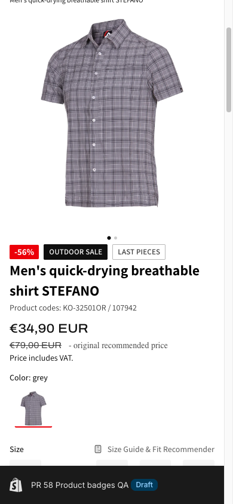
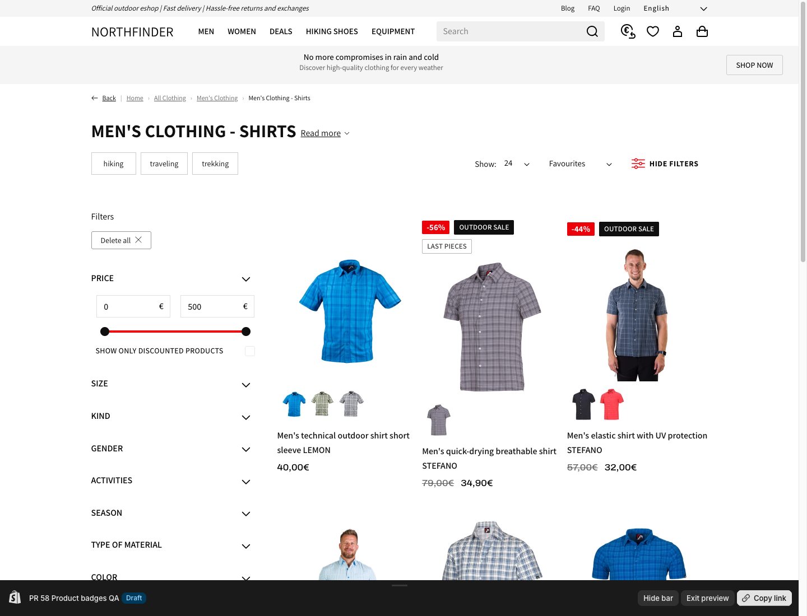
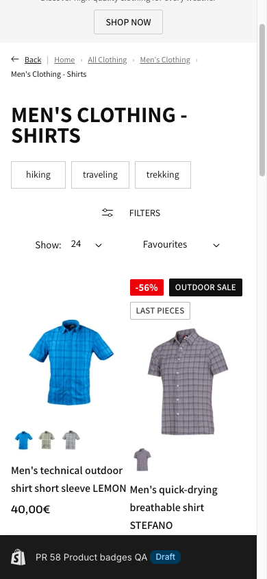

# PR 58 product badge QA evidence

## Draft theme

- Store: `sportfinder-international.myshopify.com`
- Theme: `PR 58 Product badges QA`
- Theme ID: `203593285964`
- Role: `unpublished`
- Preview: <https://shop.northfinder.com/?preview_theme_id=203593285964>
- Theme editor: <https://sportfinder-international.myshopify.com/admin/themes/203593285964/editor>

The Shopify preview bar visible in the screenshots identifies the active theme
as `PR 58 Product badges QA` with role `Draft`.

## Pages verified

- PDP:
  <https://shop.northfinder.com/products/mens-quick-drying-breathable-shirt-stefano?preview_theme_id=203593285964>
- PLP:
  <https://shop.northfinder.com/collections/mens-clothing-shirts?preview_theme_id=203593285964>

The selected product has two promotions in Shopify Admin, `Outdoor Sale` and
`Last pieces`, and a compare-at-price discount. This verifies the full canonical
order:

```text
-56% → OUTDOOR SALE → LAST PIECES
```

## Source verification

The following files were pulled back from draft theme `203593285964` and matched
the local source byte-for-byte by SHA-256:

- `snippets/product-badge-row.liquid`
- `snippets/card-product.liquid`
- `snippets/discount-badge.liquid`
- `sections/main-product.liquid`
- `sections/main-product-parfums.liquid`

## Responsive layout verification

### PDP desktop, 1440 × 1100

- Badge row width: `346.66px`
- Badge row `scrollWidth`: `347px`
- Flex wrapping: `wrap`
- Visible order: `-56%`, `OUTDOOR SALE`, `LAST PIECES`
- No horizontal badge scrollbar



### PDP mobile, 390 × 844

- Badge row width: `343px`
- Badge row `scrollWidth`: `343px`
- Document width: `375px`
- Flex wrapping: `wrap`
- All three badges remain visible and inside the parent



### PLP desktop, 1440 × 1100

- Two promoted cards were present in the verified collection viewport
- First promoted card row width: `250.64px`
- First promoted card `scrollWidth`: `251px`
- Row height: `60px`, confirming the third badge wraps to a second line
- No hidden horizontal scroller or gradient scroll affordance



### PLP mobile, 390 × 844

- Promoted card row width: `169.5px`
- Promoted card `scrollWidth`: `170px`
- Row height: `60px`
- Document width: `375px`
- `OUTDOOR SALE` and `LAST PIECES` wrap without clipping or a scrollbar



## Automated validation

- `pnpm check`
- Shopify Theme Check: `0 errors`, `187 pre-existing warnings`
- Vitest: `30 passed`
- `git diff --check`

## Draft upload note

Shopify created the unpublished theme successfully. The full-theme upload
reported existing legacy EComposer template references whose section files are
missing. These errors are unrelated to the badge files and did not prevent the
verified PDP/PLP routes from rendering. Pull-back hash verification confirmed
that all five badge-related theme files were uploaded correctly.
