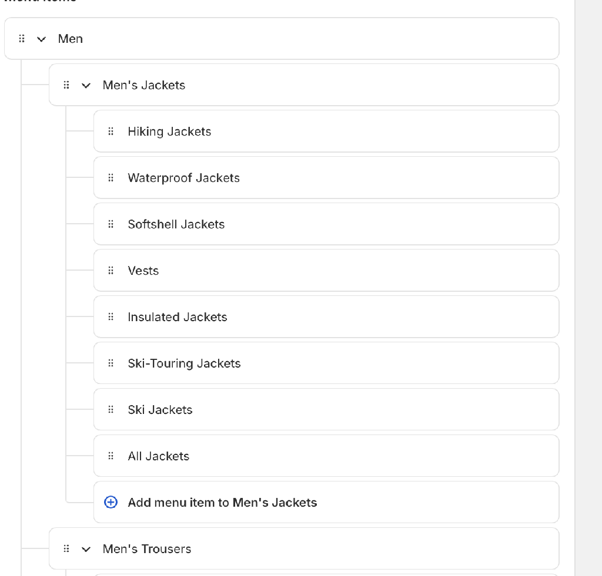
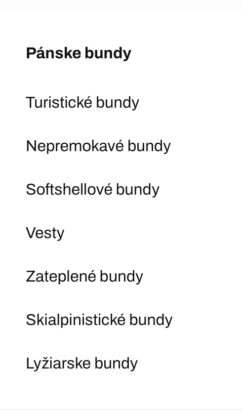
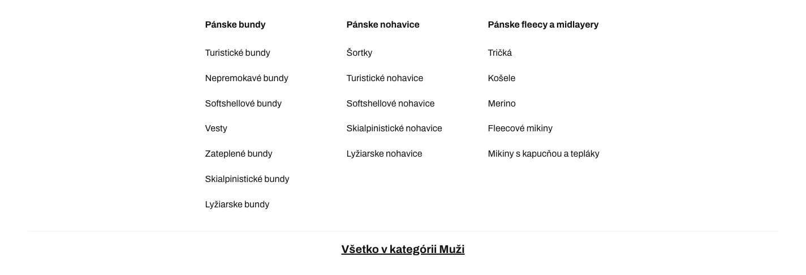
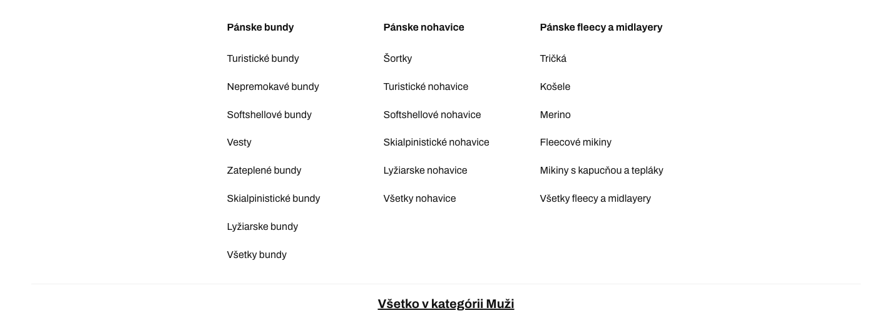
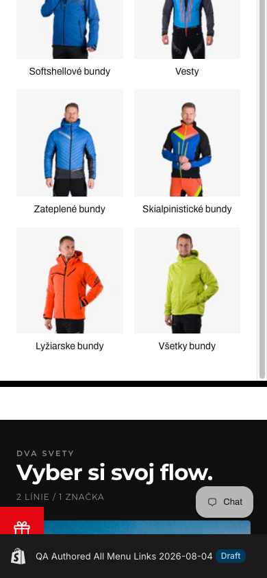

# Merchant-authored “All …” menu links evidence

Verified on 2026-08-05 against the International store and the Slovak storefront at `northfinder.sk`, matching the locale in the tester's report.

## Root cause confirmation

Shopify Admin GraphQL shows six nested menu items whose URL intentionally matches their parent category URL, including:

- `Men > Men's Jackets > All Jackets`
- `Men > Men's Trousers > All Trousers`
- `Men > Men's Fleece & Midlayer > All Fleece & Midlayer`
- the corresponding three Women's menu items

The complete filtered Admin response is stored in [`admin-duplicate-parent-urls.json`](evidence/authored-all-links/admin-duplicate-parent-urls.json).

The live desktop theme returned no matching nested `.mega-menu__link` elements. See [`live-desktop-dom.json`](evidence/authored-all-links/live-desktop-dom.json). The Liquid implementation skipped any nested link whose URL matched the parent URL.

## Draft-theme verification

- Theme: `QA Authored All Menu Links 2026-08-04`
- Theme ID: `203133616460`
- Role: unpublished
- Slovak preview: <https://northfinder.sk/?preview_theme_id=203133616460>
- MyShopify preview: <https://sportfinder-international.myshopify.com?preview_theme_id=203133616460>
- Editor: <https://sportfinder-international.myshopify.com/admin/themes/203133616460/editor>

The draft was pushed again without any `--ignore` flags so it includes `config/settings_data.json` and all valid EComposer templates/sections from the repository. Shopify retained all 129 current settings keys; it only normalized the app-embed `blocks` payload when persisting `settings_data.json`. Nine legacy EComposer JSON templates were rejected because each references a section file that does not exist in the repository; they are unrelated to the active storefront and are listed in the validation notes below.

The Slovak draft renders all six merchant-authored links in both navigation variants:

- [`draft-desktop-dom.json`](evidence/authored-all-links/draft-desktop-dom.json)
- [`draft-mobile-dom.json`](evidence/authored-all-links/draft-mobile-dom.json)
- [`full-draft-upload-verification.json`](evidence/authored-all-links/full-draft-upload-verification.json)

The uploaded draft snippets, a representative EComposer section/template pair, and active styling files were pulled back from Shopify and matched the local files byte-for-byte. The preview reports `lang="sk"`, draft theme ID `203133616460`, and the repository-configured logo/color settings.

## Screenshots

### Reporter evidence

Shopify Admin contains `All Jackets`, while the reported storefront menu omits it:

### Slovak desktop before and after

The live Slovak mega menu omits the authored links:

The full-style Slovak draft now includes `Všetky bundy`, `Všetky nohavice`, and `Všetky fleecy a midlayery` in their merchant-authored positions:

### Slovak mobile draft

The full-style mobile drawer renders the merchant-authored `Všetky bundy` tile, with collection imagery and settings from the complete draft theme:

## Validation

- Vitest: 25 tests passed, including two menu-source regression tests.
- Changed Liquid files: zero Theme Check errors.
- Existing Theme Check warnings remain:
  - `OrphanedSnippet` for both menu snippets, because Theme Check does not resolve their dynamic render path.
  - `ValidRenderSnippetArgumentTypes` for the pre-existing numeric `size: 400` argument in `header-mega-menu.liquid`.
- Full repository Theme Check remains red because of the existing legacy baseline: 314 errors and 816 warnings across unrelated files.
- The no-ignore draft push uploaded the full valid theme but Shopify rejected these nine orphaned legacy templates because their referenced section files are absent from the repository:
  - `templates/index.ecom-69eb1f8f5ae781310c01bc862.json`
  - `templates/index.ecom-69eb1f8f5ae781310c01bc8627.json`
  - `templates/index.ecom-69eb1f8f5ae781310c01bc863.json`
  - `templates/index.ecom-69eb1f8f5ae781310c01bc8626.json`
  - `templates/index.ecom-69eb1f8f5ae781310c01bc86272.json`
  - `templates/index.ecom-homepage.json`
  - `templates/index.ecom-homepagenew2.json`
  - `templates/index.ecom-hp-new.json`
  - `templates/index.ecom-northfinder-homepage-new.json`
