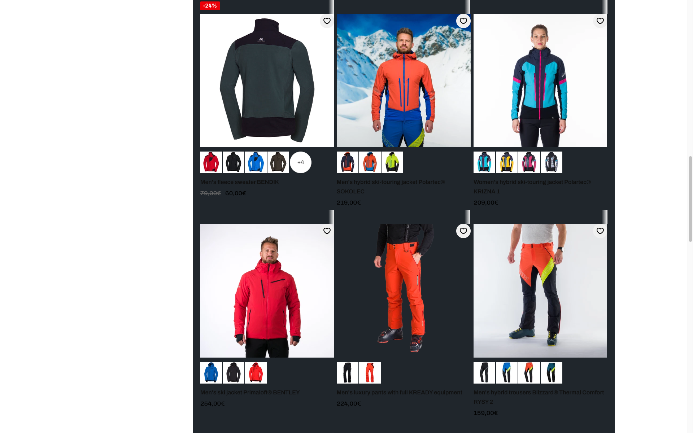
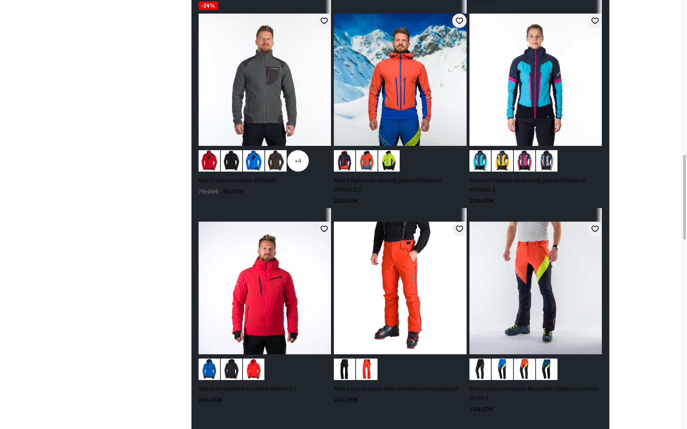

# Product card media rendering evidence

## Test setup

- Collection: `https://shop.northfinder.com/collections/all-clothing`
- Viewport: `1920 × 1200`
- Before: live theme `190888247628`
- After: unpublished QA theme `203234246988`
- The collection grid background was changed to `#20262c` in the browser only. This makes transparent product images visible against a dark section without changing either Shopify theme.
- Fixed app overlays and the Shopify preview bar were hidden in the browser only so the same product cards remain visible in both screenshots.

## Verified behavior

### Primary thumbnail selection

The `Men's fleece sweater BENDIK` card changed from a back-view asset to the lowest sequenced model asset:

- Before: `NF-MI-5000OR-316-BV.jpg`
- After: `NF-MI-5000OR-325-M_1.jpg`

This verifies that the product-code token `MI` is no longer misread as the `M` image type.

## Front-first default (2026-08-24)

The default card image is now color-aware and front-first for `selected_or_first_available_variant`:

1. `variant.featured_image` unless the filename is `-B` / `-BV`
2. Same-reference `-H` → `-M` → lowest `-M_N` → `-D_N` → `-BV` → `-B`

Hover is **not** required to be front. It uses the same color's model shot (`-M` or lowest `-M_N`). For JIMEN / SUCHY that is `M_1` (photographic back). That is accepted.

| Product | Default | Hover | Swatches |
| --- | --- | --- | --- |
| JIMEN | `464-H` front | `464-M_1` back model | `464-H` / `300-H` |
| SUCHY | `811-H` front | `811-M_1` back model | `811-H` / `170-H` |

Do not treat `M_1` as a back-type token. `B` / `BV` are the only back types. JIMEN `300-M_1` is already a front.

### Transparent image background

The transparent PNG card for `Men's luxury pants with full KREADY equipment` inherits the dark collection background before the change. After the change, its product media wrapper has a computed background of `rgb(255, 255, 255)`.

The same computed white background was verified on the BENDIK native product-card wrapper.

## Screenshots

### Before

### After

